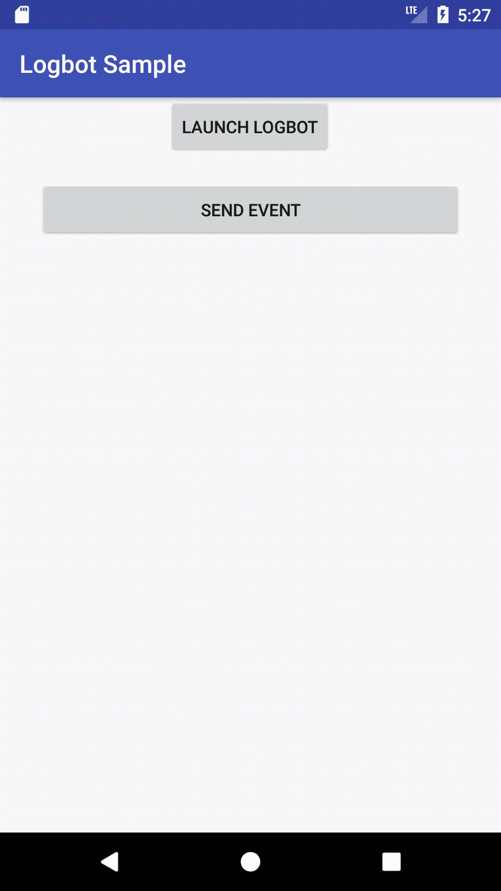

# Logbot

View logs on top of your application



## What's this for?

There is a case when you want to show logs on top your app. Well, I do when I'm not in front of my
lap top but want to check a specific tracking log is sent as expected.

This library displays logs on a window that opens on top of your app. You can send any log to the 
window and share it out side the app. 

## How to use it?

### Download
Grab it from Gradle:

```groovy
debugCompile 'com.tomoima.logbot:logbot:{latest_version}'
releaseCompile 'com.tomoima.logbot:logbot-no-op:{latest_version}'
```

{latest_version} is now :[ ](https://bintray.com/tomoima525/maven/logbot/_latestVersion)

Make sure you compile `logbot-no-op` in the release build.

### Initialize

Call `Logbot.setup(this)` at `onCreate()` method of either your Application class or Activity. You only have to call it once.

By default, the log buffer size is 50. If you want to change it, set it through `LogbotSettings` 

```kotlin
class MyApplication : Application() {
    @Override
    fun onCreate() {
      super.onCreate()
      val setting = LogbotSettings.Builder().bufferSize(100).build()
      Logbot.setup(this, setting)
    }
}
```

Launch Logbot by calling `LogbotLauncher.startOverlay(this)`. Logbot will be turned on until you 
press `x` on the window.

Send logs by using `Logbot.send()`. You can use a formatting like below.

```kotlin
private var count = 0
Logbot.send("[$count] message:\n %s", UUID.randomUUID())
```

See more in sample app.

## License

```
Tomoaki Imai 2018
Licensed under the Apache License, Version 2.0 (the "License").
You may obtain a copy of the License at

http://www.apache.org/licenses/LICENSE-2.0

Unless required by applicable law or agreed to in writing, software distributed
under the License is distributed on an "AS IS" BASIS, WITHOUT WARRANTIES
OR CONDITIONS OF ANY KIND, either express or implied. See the License for
the specific language governing permissions and limitations under the License.

You agree that all contributions to this repository, in the form of fixes, 
pull-requests, new examples etc. follow the above-mentioned license.
```